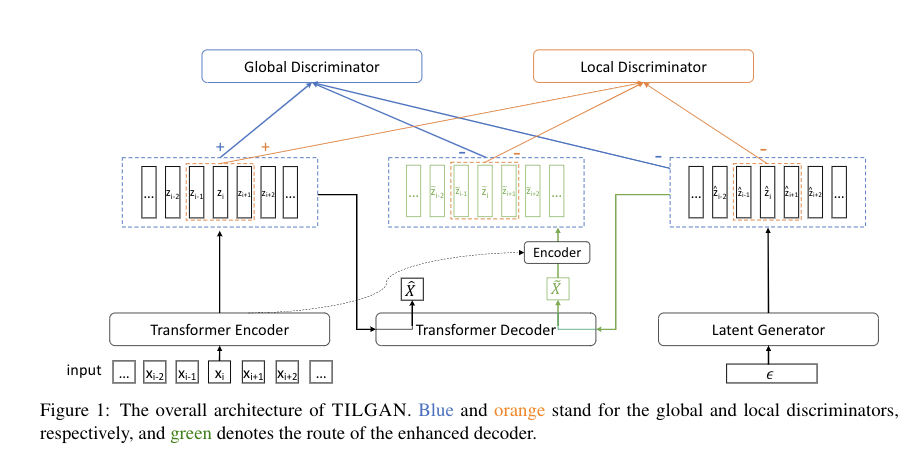

# TILGAN

Source code for the Findings of ACL 2021 paper entitled  `TILGAN: Transformer-based Implicit Latent GAN for Diverse and Coherent Text Generation`.

## Quick Links
- [TILGAN](#tilgan)
  - [Quick Links](#quick-links)
  - [Overview](#overview)
  - [Organization](#organization)
  - [Bugs or Questions?](#bugs-or-questions)
  - [Citation](#citation)
  - [Quick Tour](#quick-tour)
## Overview
Conventional autoregressive models have achieved great success in text generation but suffer from the exposure bias problem in that token sequences in the training and in the generation stages are mismatched. 
While generative adversarial networks (GANs) can remedy this problem, existing implementations of GANs directly on discrete outputs tend to be unstable and lack diversity. 
In this work, we propose TILGAN, a Transformer-based Implicit Latent GAN, which combines a Transformer autoencoder and GAN in the latent space with a novel design and distribution matching based on the Kullback-Leibler (KL) divergence. 
Specifically, to improve local and global coherence, we explicitly introduce a multi-scale discriminator to capture the semantic information at varying scales among the sequence of hidden representations encoded by Transformer. 
Moreover, the decoder is enhanced by an additional KL loss to be consistent with the latent generator. 
Experimental results on three benchmark datasets demonstrate the validity and effectiveness of our model, by obtaining significant improvements and a better quality-diversity trade-off in automatic and human evaluation for both unconditional and conditional generation tasks.



You can find more details of this work in our paper [LINK].

## Organization
This is the file organization of TILGAN, `...` means omitting the subfolder.
   ```
    ${TILGAN}
   |-- Conditional Generation
   |   |-- Data             # The Data Folder
   |   |   `-- ...
   |   |-- adversuc.py      # Evaluate Adversarial success
   |   |-- bleu.py          # Evaluate BLEU
   |   |-- data_utils.py    
   |   |-- model.py         # Models
   |   |-- modules.py
   |   |-- multi_bleu.py    # Evaluate BLEU
   |   |-- README.md        # Insrtuction for running CG
   |   |-- requirements.txt # Pkgs
   |   `-- train.py         # Main trainging file
   |
   `-- Unconditional Generation
   |   |-- data             # The Data Folder
   |   |   `-- ...
   |   |-- onmt             # Pkgs
   |   |   `-- ...
   |   |-- pycocoevalcap   
   |   |   `-- ...
   |   |-- bleu_self.py     # Evaluate BLEU_self
   |   |-- bleu_test.py     # Evaluate BLEU_test
   |   |-- bleu.py          
   |   |-- models.py        # Models
   |   |-- README.md        # Insrtuction for running UG
   |   |-- requirements.txt # Pkgs
   |   |-- train.py         # Main trainging file
   |   `-- utils.py
   |
   `-- Figures
   |   `-- TILGAN.png
   |  
   `-- README.md
   
   ```
## Bugs or Questions?

If you have any questions related to the code, feel free to email Shizhe Diao (`sdiaoaa@connect.ust.hk`) or Kashun Shum (`ksshumab@connect.ust.hk`). 
If you encounter any problems when using the code, or want to report a bug, you can open an issue. 
Please try to specify the problem with details so we can help you better and quicker!

## Citation
If you use or extend our work, please cite the following paper:
```
@article{DSSSZ2021,
  title="{TILGAN: Transformer-based Implicit Latent GAN for Diverse and Coherent Text Generation}",
  author={Shizhe Diao, Xinwei Shen, Kashun Shum, Yan Song, Tong Zhang},
  journal={ArXiv},
  year={2021},
  volume={}
}
```

## Quick Tour
We perform experiments on both conditional task and unconditional task, and seperate them into two folders.
- [Conditional Generation]() : We perform experiments on ROCStory Dataset.
- [Unconditional Generation]() : We perform experiments on WMT News and MS COCO Dataset.

---

You can follow the steps in each folder to reproduce our experiments.
